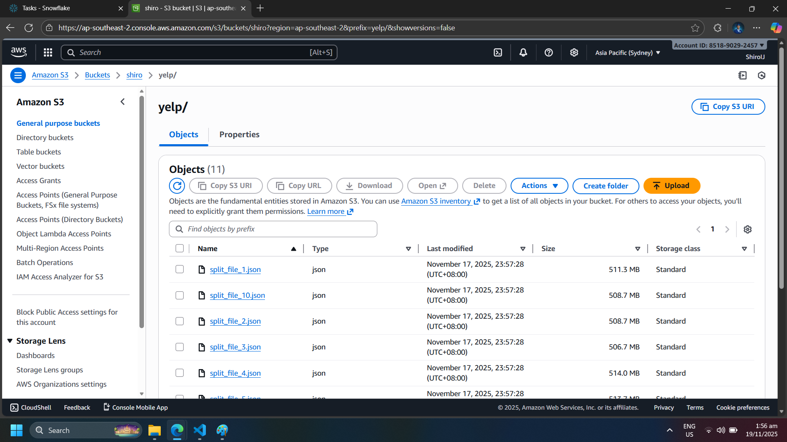
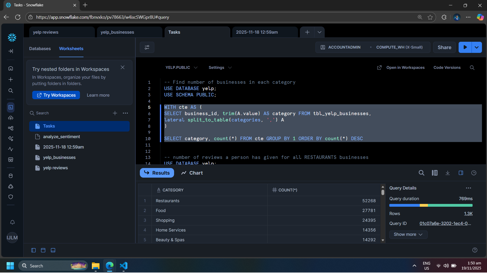

# Yelp Review Sentiment Analysis with AWS S3, Snowflake, and Python

> **Disclaimer:**  
> This project is *based on* the YouTube tutorial by **Ankit Bansal**:  
> https://www.youtube.com/watch?v=oXLxbk5USFg  
>
> Original GitHub Repository of the creator:  
> https://github.com/ankitbansal6/end_to_end_data_analytics_project  
>
> This repository contains **my own implementation** of the workflow demonstrated in the tutorial.  
> No original source code from the creator’s repository has been copied or redistributed.

---

## 📌 Overview

This project demonstrates an end-to-end data engineering and analytics workflow using:

- **Yelp Open Dataset**
- **AWS S3** for cloud storage
- **Snowflake** for data warehousing
- **Python** for preprocessing and sentiment analysis
- **SQL** for querying, transforming, and analyzing data

The goal is to process Yelp review and business data, load it into Snowflake, add sentiment scoring via a UDF, and perform several analytical tasks.

---

## 📂 Project Workflow

### **1. Download & Extract the Yelp Dataset**
- Downloaded the Yelp dataset `.tar` file.
- Extracted the contents to access:
  - `yelp_academic_dataset_review.json`
  - `yelp_academic_dataset_business.json`
  - (Other dataset files were not used.)

> **Note:** The script used to split the large Yelp review JSON file into smaller chunks
> (`split_files.py`) is available in the original repository by Ankit Bansal:  
> https://github.com/ankitbansal6/end_to_end_data_analytics_project  
> I executed the script to prepare the data for Snowflake ingestion, but the script itself is **not included here**.

---

### **2. Data Preprocessing in Python (Jupyter Notebook)**
- Split the Yelp review dataset into smaller JSON files (10 files total) to optimize upload to AWS S3.  
- Each file was uploaded to **AWS S3** for cloud storage.

---

### **3. Loading Data into Snowflake from AWS S3**
- Used Snowflake’s `COPY INTO` and `FILE FORMAT` to load JSON files from S3 into Snowflake tables.  
- Flattened nested JSON fields into structured columns for analysis.

---

### **4. Adding Sentiment Analysis**
- Created a new column `sentiment` for each review text using a Snowflake UDF.  
- Sentiment values:
  - `positive`
  - `neutral`
  - `negative`

---

## 📊 Data Analysis Tasks

Performed various SQL analyses, including:

1. Number of businesses in each category  
2. Top 10 users who reviewed the most businesses in "Restaurants"  
3. Most popular business categories (based on number of reviews)  
4. Top 3 most recent reviews for each business  
5. Month with the highest number of reviews  
6. Percentage of 5-star reviews for each business  
7. Top 5 most reviewed businesses in each city  
8. Average rating of businesses with at least 100 reviews  
9. Top 10 users with the most reviews, along with the businesses they reviewed  
10. Top 10 businesses with highest number of positive sentiment reviews

---

## 🖼 Screenshots / Proof of Work

### AWS S3 Upload

### Snowflake Table Preview

> These screenshots demonstrate that the data was uploaded to AWS S3 and successfully loaded into Snowflake.

---

## 🙌 Acknowledgment

This project is **based on and inspired by** the tutorial by **Ankit Bansal**:

- YouTube Video: https://www.youtube.com/watch?v=oXLxbk5USFg  
- Original GitHub Repository: https://github.com/ankitbansal6/end_to_end_data_analytics_project  

While the **overall workflow** follows the tutorial, **all implementation in this repository (Python scripts, SQL queries, and analysis) was written and executed by me**.

---
